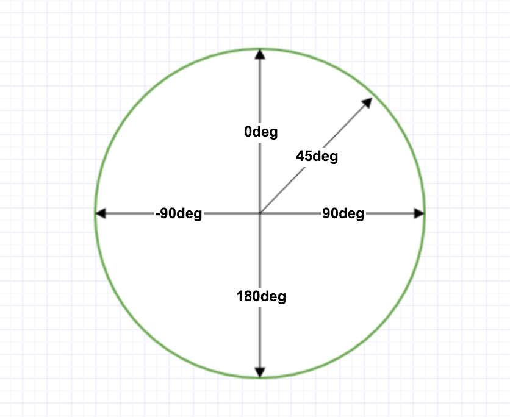

# Media-Style-Palette

This package is the Web Front-End implementation of [Media-Style-Palette](https://github.com/mkaflowski/Media-Style-Palette),
which extracts primary, secondary text color and background color from a given artwork,
based on [node-vibrant](https://github.com/akfish/node-vibrant).

The code in [Media-Style-Palette](https://github.com/mkaflowski/Media-Style-Palette) points out the color
exactly used in Android Oreo (see demonstration in its README).
But according to the implementation of quantizer and scale down factor used in downsampling stage,
the output of this program may be somehow differ from the media notification of Android Oreo.
Note that the result could also be different across different browsers.

Take a live demo at [media-style-palette.js.org](https://media-style-palette.js.org/).

## Usage

```javascript
import MediaStylePalette from 'media-style-palette'

new MediaStylePalette({
  direction: -90,
})
  .from(document.getElementById('my-img'))
  .getPalette()
  .then(palette => {
    console.log(palette)
  })
```

The direction option is the angle with 12 o'clock direction,
clockwise as the positive direction, presented in deg.
In other words, 0 represents the background color is using above
the image, -90 represents the background color is using on the left
of the image (like the Android Notifications do). This direction is
the same with CSS linear-gradient direction.



An example of use is placed in the `example` folder.
